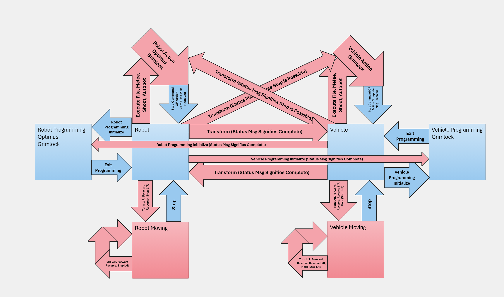

This project is not affiliated with either Robosen or Hasbro in any way.

# USE AT YOUR OWN RISK

* There is no guarantee that any of this will work in any case with any robot, but it has worked for us.
* Any unfinished parts of the code are guaranteed to fail if used.
   * Currently this includes the programming commands and some other commands. 
* USB mode is not enabled on later models of the robots' apps for a reason. If you use the usb mode **_DO NOT_** remove any files from the robot. Removal of files will damage your robot and will likely void the warranty, as well.

## Robosen Transformers

Robosen, in association with Hasbro, has created a wonderful line of Transformers robots which can be programmed to perform preplanned actions. They also provide a mobile phone app that sends commands and receives status from the robots.

## This Project

We are fans of Transformers, robotics, and reverse engineering. We were also trepidatious about the longevity of a mobile app, as most products' mobile apps lose support shortly after the warranty period ends. As such, we were very interested in figuring out how these things work and reproducing the interactions in an API (Application Programming Interface) so that continued use and alternate controls can be used with the robots.
* **_NOTE_**: If you have a robot that is not listed under the **Development Notes** section, please contact Chris (in the **Who We Are** section) and we can assess your robot's abilities and BLE name for inclusion in this code.
   * **_Optimus Prime Elite_** is likely to be little more than adding his BLE name and categorizing him as an Optimus Prime platform, but we did not have access to the elite version during production of this API

## Who we are

Chris and Terry Meacham --- You can reach us directly at chris at meacham.dev and terry at meacham.dev

## How to run it

1) Clone this github repo to a working directory and then go there in a terminal
1) Make sure to install the dependencies in `requirements.txt`
   * `pip install -r requirements.txt`
1) Run the code in either text mode or joystick mode (make sure a supported joystick is turned on and connected)
   * `python repl.py --text`
   * `python repl.py --joystick`
1) To test your joystick run the code with the `--test_joysticks` flag
   * `python repl.py --test_joysticks`

## Joystick Mappings

* Right Trigger moves forward
* Left Trigger moves in reverse
* Left (or only) stick turns while in forward or reverse
* Left (or only) stick steps while in robot mode and stopped
* Clicking right (or only) stick transforms
* Upper button starts melee attack (or honks horn)
* Left button starts shooting (or honks horn)
* Right button performs a special system action (Autobot button in the App)
* Lower button changes speed on Grimlock
* Start, menu, +/- button rescans for new robots or new joysticks
* Touchpad, back, home/capture button disconnects all robots and exits the program
* Joystick mappings are based on PyGame 2.x and include
   * Xbox 360 Wireless
   * PlayStation 4 (Dual Shock 4)
   * Nintendo Joycon (assumes horizontal orientation and supports both left and right)
   * Xbox One Series X
   * PlayStation 5 (DualSense)
   * _Xbox 360_
   * _Xbox One Series S_
*  Italics denotes untested on Windows and assumes [PyGame's Joystick documentation](https://www.pygame.org/docs/ref/joystick.html) is correct which it seldom is. All joysticks are untested on Linux and MacOS. _Nintendo Switch Pro_ is not supported but we are willing to include it if provided mappings for it.
*  If you have one of the italicized controllers on Windows, or any of them on Linux or MacOS, please run `repl.py` with `--test_joysticks`, map out all buttons and axes, and then send the info to us or optionally make a patch yourself and submit a pull request.

## Development Notes

### Known BLE Names (Tested Robots)
* Optimus Prime Flagship is OP-M-&lt;serial number&gt;
* Grimlock is GSEG-&lt;serial number&gt;
* Megatron is MEGAF-&lt;serial number&gt;

### TODOs:
* Cleanup Code and backlog for open source release
* Look for status change while commanding a robot action from vehicle and vice versa and then remove the 10 second wait if found
   * This has failed. While it does report the state after transforming, Grimlock does not indicate which mode the action will be in and if I request the state it will stop the action... I should read the file first and either decode the initial info or match the servo positions with the prog_init RobotStates
   * That failed too. I have not been able to receive the Action data when reading from the file. Now just waiting for the action to complete and then checking the current mode.
* Grimlock only provides robot and vehicle servo states so I believe these are the offsets used for each mode
   * Test this by ignoring the neutral offsets for Optimus and using the robot and vehicle offsets exclusively.
* In text mode, catch 'Up' and 'Down' keys and spit out previous commands
* Add position get print with commas so it can be copied, pasted, edited, and sent back
* Wheel increments from -100 to 100, positional in programming mode, but may be a speed of rotation for programmed actions.

### Servo Limits Unaccounted For
* Grimlock Vehicle Mode
   * Same servos as robot mode but with different limits
   * Servo Label Name [Min, Max]
   * Head [-60, 0]
   * Mouth [-40, 0]
   * Left-right Neck [-80, 80]
   * Right Shoulder [-50, 120]
   * Right Arm [-5, 60]
   * Right Elbow [-100, 100]
   * Right Lower Arm [-60, 60]
   * Left Shoulder [-120, 50]
   * Left Arm [-60, 5]
   * Left Elbow [-100, 100]
   * Left Lower Arm [-60, 60]
* Grimlock only provides robot and vehicle servo states so I believe these are the offsets used for each mode

State whiteboard:

# LICENSE

Licensed under the FreeBSD License
Copyright (c) 2024, Chris Meacham and Terry Meacham

Redistribution and use in source and binary forms, with or without modification, are permitted provided that the following conditions are met:

1. Redistributions of source code must retain the above copyright notice, this list of conditions and the following disclaimer.
2. Redistributions in binary form must reproduce the above copyright notice, this list of conditions and the following disclaimer in the documentation and/or other materials provided with the distribution.

|                                                              |
|--------------------------------------------------------------|
|THIS SOFTWARE IS PROVIDED BY THE COPYRIGHT HOLDERS AND        |
|CONTRIBUTORS "AS IS" AND ANY EXPRESS OR IMPLIED WARRANTIES,   |
|INCLUDING, BUT NOT LIMITED TO, THE IMPLIED WARRANTIES OF      |
|MERCHANTABILITY AND FITNESS FOR A PARTICULAR PURPOSE ARE      |
|DISCLAIMED. IN NO EVENT SHALL THE COPYRIGHT OWNER OR          |
|CONTRIBUTORS BE LIABLE FOR ANY DIRECT, INDIRECT, INCIDENTAL,  |
|SPECIAL, EXEMPLARY, OR CONSEQUENTIAL DAMAGES (INCLUDING, BUT  |
|NOT LIMITED TO, PROCUREMENT OF SUBSTITUTE GOODS OR SERVICES;  |
|LOSS OF USE, DATA, OR PROFITS; OR BUSINESS INTERRUPTION)      |
|HOWEVER CAUSED AND ON ANY THEORY OF LIABILITY, WHETHER IN     |
|CONTRACT, STRICT LIABILITY, OR TORT (INCLUDING NEGLIGENCE OR  |
|OTHERWISE) ARISING IN ANY WAY OUT OF THE USE OF THIS SOFTWARE,|
|EVEN IF ADVISED OF THE POSSIBILITY OF SUCH DAMAGE.            |
|                                                              |
